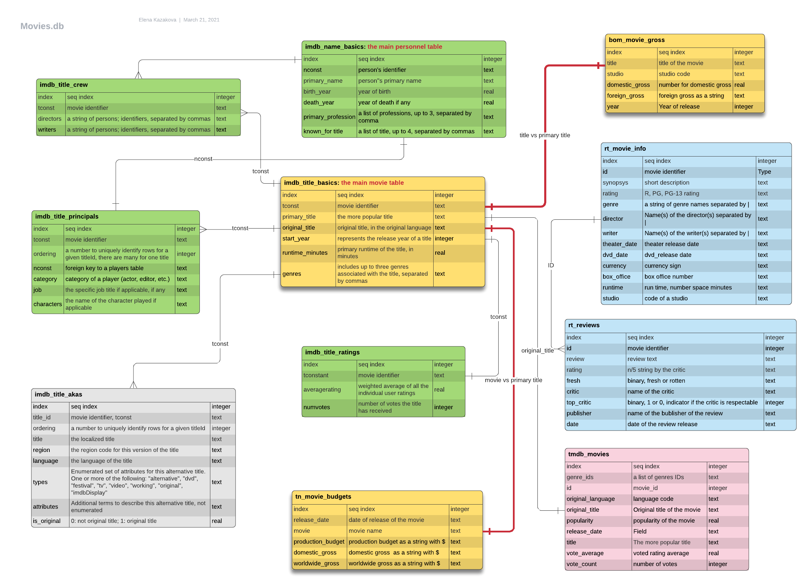
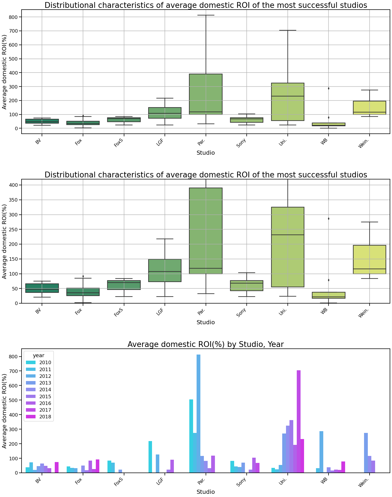
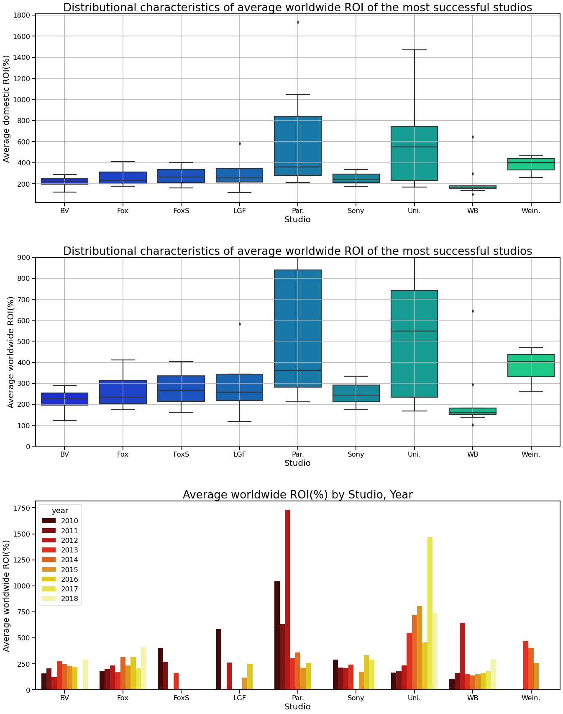
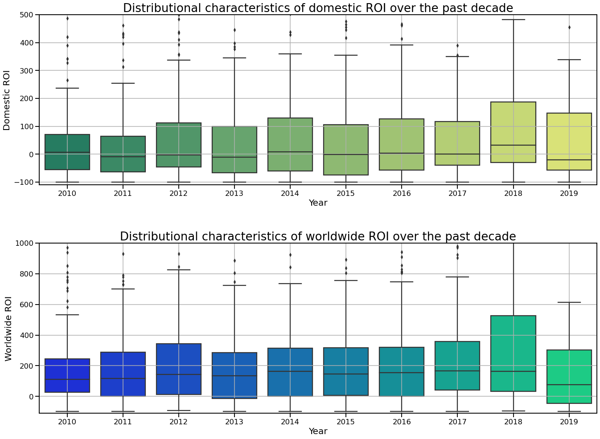
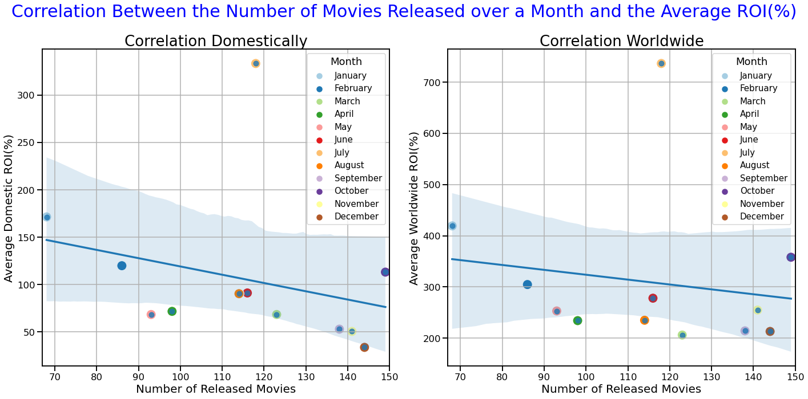
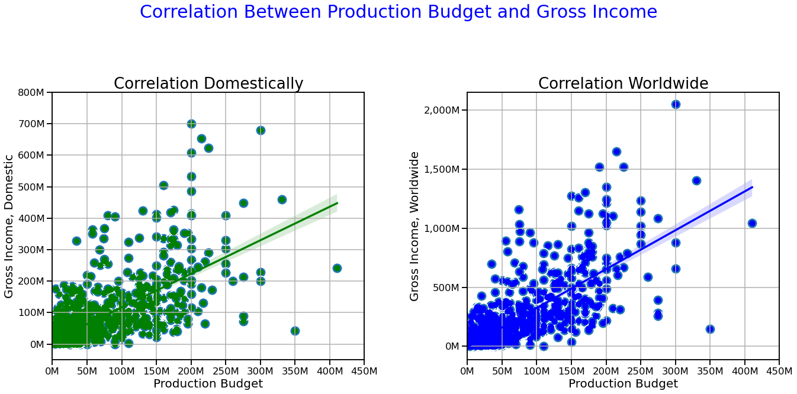
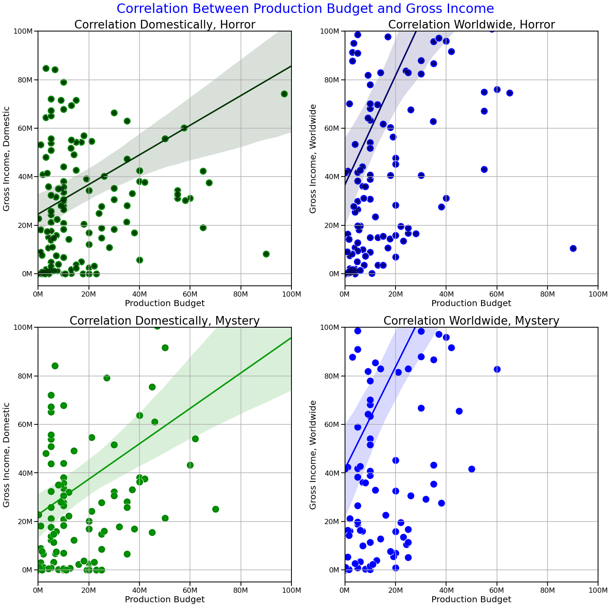
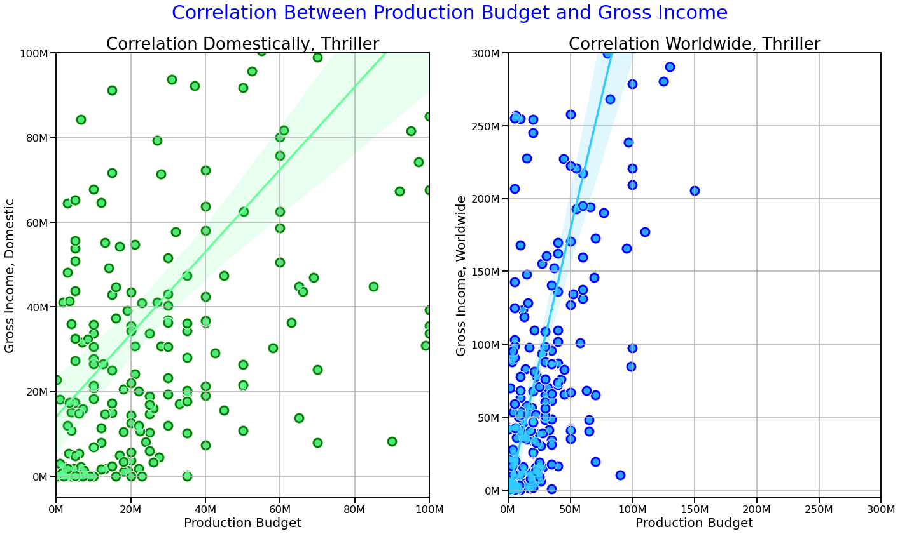

Copyright: <a href='https://www.123rf.com/profile_jagcz'>Jakub Gojda</a>

# How a company squeezes into "making movie business" and gets successful

<span style="color:red; font-size:1.5em">**Phase 1 Final Project**</span><br>
**Authors:** Elena Kazakova<br>
**Cohort:** DS02222021<br>
**Instructor:** James Irving
***

## Overview

This project analyzes the three publically available online databases, IMDb, TN, and BOM. IMDb (an acronym
for Internet Movie Database) is an online database of information related to films, television programs, home
videos, video games, and streaming content online. The Numbers (TN) is a film industry data website that tracks box office revenue in a systematic, algorithmic way. Box Office Mojo (BOM) is an American website that
tracks box-office revenue in an organized, algorithmic way. Descriptive analysis suggests that a company
looking into joining a lucrative movie business needs to partner with the studios producing the highest ROIs,
look into investing in making movies in Horror, Mystery, and Thriller genres, and carefully plan the release
date of their products.

## Business Problem

Microsoft sees all the big companies creating original video content, and they want to get in on the fun. They
have decided to create a new movie studio, but they don't know anything about producing movies. They need
recommendations on how to minimize the risk to their investment and maximize their
future products' profitability. Though the scope of this project is limited and, further in-depth analysis should be considered, the results of the study reveals several valuable recommendations. <br>

***

## Data Understanding

As pointed out in the overview section, the project uses the data from three databases already available as zipped CSV files imported from  IMDb, TN, and BOM databases. Additional data from Rotten Tomatoes (RT) and The Movie Database (TMdb) were explored and initially considered, and it has been decided not to use this information in the analysis performed. This data might be considered for future exploration. To make this decision, analysis of the content in all the sources available was performed, a data diagram of all the tables was created, and only tables with movie financial and most easily joined tables have been chosen for further analysis. <br>
The decision has been made to limit the analysis considering only data for movies released within the last decade<br><br>The rest of the tables should be considered for performing analysis of ratings and professional staff performance. Another consideration for the data sources' choice was the number of movie records available in each of the tables. Please see below the description and the results of the data sources analysis.
***
* The CSV zipped files were unzipped, and the data was imported into an SQLite database.
* To investigate in more detail data available in all available tables, an Entity Relation Diagram was created with LucidChart online application. Please see the diagram below<br>.

* Data in the tables was reviewed for duplicates and NULL values. Where appropriate NULL values in categorical columns were replaced with a "Missing" category
* Date values in text format were converted by DateTime pandas method into separate columns (year, month, quarter)
* Records for movies released before 2010 and after 2019 were deleted 
* Three tables with financial data, studio and genres data to be used in the analysis process were joined using movie titles and year of release.
***

## Methods

TA descriptive analysis of the data was performed. The study was intended to answer four main questions:

***
* What studios are most successful in the movie production business?
* Does the runtime of a movie affect the movie's profitability?
* How does the timing of a movie release affect its' profitability?
* What movie genres are most profitable considering Return of Investment measurement?
***
## Results

  ### Descriptive analysis of studio profitability data
  The results of the analysis for Domestic and Worldwide ROI of movies produced by different studios are as follows:
  * Visualization of the results<br>
  
  

  #### The visualized data indicates that
 * Universal Studios, Paramount Pictures, The Weinstein Company, and Lions Gate Films Corporation studios (in that order) have been the most successful studios over the course of the last nine years. The median of the average domestic ROI for these studios is above 100 %, and lower and upper quartiles are between 50% and 400%, with wiskers of all four never going below the red line.
  * The same tendencies can be observed in the analysis of movies' worldwide profitability by significant players in the industry. Universal Studios, Paramount Picture, The Weinstein Company, and Lions Gate Films Corporation studios remain the most successful American studios globally. However, all of the studios under consideration maintained an average ROI above 100%.
  
### ROI statistics evaluation
The results of the analysis of ROI statistical characteristics are as follows:
* Visualization of the results<br>
 

#### The visualized data indicates that
* Though the distribution of domestic ROI shows that the median of it over the years is remaining close to 0%, the overall tendency is shifted toward the upper quartile, and the mean is close to 100%.<br>
The distribution of worldwide ROI assures a more promising outcome for newcoming studios, with lower and upper quartiles above 0% and the mean of the distribution slightly above 300%.<br>
* The customer should be advised to expand into foreign markets to increase their overall profit. Additional analysis is suggested for the most promising foreign markets.

### Descriptive analysis of month of release/ROI correlation
The results of the analysis are as follows:
* Visualization of the results<br>
 

* The data above suggests a negative correlation between the number of the movies released and the ROI (domestic and worldwide), which might be related to the choice of released movies customers have in a particular month along with holidays and weather in each month.
* Visualization of the results of descriptive analysis of potential correlation is presented below


#### The visualized data indicates that
* The negative correlation between the number of movies released over a time period suggests that the customer should consider this factor when planning a movie release. The only exception is the month of July, an outlier among other months of a year. It seems that no matter how many movies are in the theaters, it will be more profitable than in other months of a year.

### Descriptive analysis of genre effect on movies profitability
The results of the analysis are as follows:
* Visualization of the results<br>

#### The visualized data indicates that
* The three most profitable genres are Horror, Mystery, and Thriller (in that order), both domestically and abroad. There is a strong presence on the second plot of the "Unknown" category of movies released internationally. That might be in part due to a practice of categorizing them abroad differently. It is just a guess, but given the significance of the difference, the issue should not be brushed aside but further investigated

### Descriptive analysis of a size of production budget on gross income of a movie
The results of the analysis are as follows:
* Visualization of the results<br>

* The correlation between Gross Income and budget can be seen in the plots above. However, it might be too congested because the movies of different genres are combined in these plots. It is logical to assume that movies of different genres might have different budget needs. For example, horror movies are cheaper to produce, while sci-fi or action movies are pretty expensive. The next step is to put side by side the plotted correlations within all three genres that performed the best on their ROI (Horror, Mystery, Thriller), both domestically and abroad.
* Visualization of the results<br>
Horror and Mystery categories:

* One can expect a ratio between gross income and production for movies in Horror and Mystery categories with budgets of 20 million and lower close to 2.0 domestically and to 3 .5 internationally. However, as the budget grows, the return drops

* Visualization of the results<br>
Thriller category:

* Visual investigation of the plots above suggests that while Thriller movies do not perform entirely as well as horror and mystery movies domestically, i.e., the regression model indicates that 20 million investment would generate slightly above 30 million in gross income. Internationally, thriller movies tend to do much better, and an estimated average ratio of gross income to production budget ratio is about 3.5. The recommendation to the customer is to release a movie both domestically and internationally to maximize the return on investment.<br>
* The conclusion is that Thriller movies' budgets should be higher than those of Horror and Mystery movies to generate higher Gross Income. The production of **several** Horror/Mystery movies might cost the same as the production of one Thriller movie to generate the same gross profit amount. However, production of several movies versus production of one might be a smart move because it increases the probability of success overall, "not putting all your eggs in one basket" approach.


## Conclusions

**The customer is advised:**
* To either partner with Universal Studios, Paramount Pictures, The Weinstein Company, and Lions Gate Films Corporation studios (in that order) or invest in investigating their business practices and replicating them in their business.
* To carefully plan the timing of releasing their movies because ROI tends to be higher in the periods when fewer movies are available to the viewers. The only exception is the month of July, an outlier among other months of a year. It seems that no matter how many movies are in the theaters, it will be more profitable than in other months of a year.
* To invest in the three most profitable genres in terms of a return on investment, Horror, Mystery, and Thriller (in that order), both domestically and abroad. Their production budgets tend to be lower than movies in other genres, but the ratio between their gross incomes and the production costs is higher. In other words, it is more profitable to make many movies in these genres than just one movie in a genre with higher production costs and higher one-movie gross income. These tactics have the additional benefit of minimizing the risk of investment.
***
**Additional analysis suggested:**
* Update data available for analysis by either creating APIs with the sources or webscraping their sites
* Investigate the effect of a choice of directors/writers on profitability of a movie using additional tables in the database
* Use Rotten Tomatoes tables to analyze the correlations between the profitability of a movie and its' critics rating and viewers' rating
* Replicate the analysis of this project using Rotten Tomatoes tables to confirm the findings
<br>
<br>

## For More Information

Please review our full analysis in [our Jupyter Notebook](./dsc_phase1_project_EVK_final.ipynb) or our [presentation](./DS_Phase1_Project_Presentation.pdf).

For any additional questions, please contact **Elena Kazakova @ e.v.kazakova@gmail.com**

## Repository Structure


```
├── README.md                                              <- The top-level README for reviewers of this project
├── README.pdf                                             <- The top-level README for reviewers of this project in PDF format
├── dsc_phase1_project_EVK_final.pdf                       <- Final Project Jupyter notebook as a PDF file
├── dsc_phase1_project_EVK_final.ipynb                     <- Final Project Jupyter notebook
├── dsc_phase1_project_EVK_final_backup_03282021.ipynb     <- The latest backup of the notebook
├── DS_Phase1_Project_Presentation.pdf                     <- PDF version of project presentation
├── Instructions.md                                        <- Flatiron instructions for this project
├── repo.pdf                                               <- Github repo structure image
├── data                                                   <- Contains 3 directory: zippedData, unzippedData and sqlite
├── old_files                                              <- Files not in use
├── zippedData                                             <- original zipped files
└── images                                                 <- Both sourced externally and generated from code
```
